# 问题三 算力约束下的多维资源联合优化

## 摘要

本问在问题一的领域质量接口和问题二的标度律基础上，联合优化参数量 N、训练数据量 D、质量目标 Q 与 17 域配比 p。为满足 Q4 与 C6 的 Loss 尺度契约，对外主情景采用 B1 的 Pythia 经典项 (A,B,α,β) 与 B6–B8 λ=10 的质量项 (γ,θ) 组成的混合口径；它不是单一数据集上的联合估计。B6–B8 原生口径仍作为独立质量数据敏感性结果完整保留。预算覆盖 10^19--10^27 FLOPs，连续 `Loss*(C)` 仅是预算网格上的对数分段插值。Q1 的 17 域 Q 有 14 个中位数插补，Qbar 的方差相对仅观测域重闭合口径损失 91.4%，故质量—配比部分是弱证据。主情景中 Q 达到 0.95 上界，质量维度的内点权衡不可识别；部分高预算情景触及 N 上界时，只能解释为情景边界与成本函数的共同结果。

## 1 问题重述与数据边界

目标是在算力预算 C 下配置 N、D、Q 和 p，使代理验证损失最小。预算覆盖 10^19、10^22、10^24、10^25、10^26、10^27 FLOPs，Lctx 采用 C7 的离散支持值。Q1 的 Qbar 插补方差损失为 91.4%，Qbar(p) 只作为弱证据。B1 与 B6–B8 的数据口径不同，因此不将单个系数拆开互换；供 Q4 使用的完整混合情景明确记录为 B1 经典项与 B6–B8 质量项的跨数据源组合。

| coefficient_source | parameter_group | value |
| --- | --- | --- |
| b6_b8_lambda10 | A | 0.8111 |
| b6_b8_lambda10 | B | 0.5641 |
| b6_b8_lambda10 | alpha | 0.2334 |
| b6_b8_lambda10 | beta | 0.2625 |
| b6_b8_lambda10 | gamma | 1.5165 |
| b6_b8_lambda10 | theta | 1.0868 |
| b1 | A | 2.0824 |
| b1 | B | 1.2552 |
| b1 | alpha | 0.0661 |
| b1 | beta | 0.2762 |
| b1 | gamma | 1.5165 |
| b1 | theta | 1.0868 |

主情景使用 expanded: N∈[0.07,5000]、D∈[0.134,4000]；legacy 对照为 N∈[0.07,1000]、D∈[0.134,5000]。边界是用于控制外推范围的情景设定，不是题目给定或物理可达上限。Q4 前沿从 expanded 情景构造，以覆盖 10^27 FLOPs；超过已观测规模的部分仍是模型外推。

## 2 符号与模型

N、D 分别以十亿参数和十亿 Token 计，p_i≥0.001 且 Σp_i=1，Q0≤Q≤0.95。配比采用带下界的 softmax 参数化，保证每个领域有最小代表量。

$$C_{train}=0.006ND,\qquad C_{attn}=C_{train}\frac{ηL_{ctx}}{6},\qquad C_Q=10^{-12}D[g(Q)-g(Q_0)]_+.$$ 

$$L=A N^{-α}+B D^{-β}+γ(1-Q_{eff})^θ+0.08t^T(p-p_0)+0.03\sum_i p_i\ln(p_i/p_{0i}).$$

Q_eff=1-(1-Q)Q0/Q̄(p)，Q̄(p)=Σp_iQ_i^*。p 项系相对替代效应：提高一个领域意味着从其他领域挪出相同比例。二阶表只报告独立测试二次模型的预测非加性差分，不解释为因果协同。

## 3 两套参数口径

Q4 对外主情景的经典项为 B1 Pythia 联合拟合的 A=2.0824、B=1.2552、α=0.0661、β=0.2762；质量项为 B6–B8 λ=10 的 γ=1.5165、θ=1.0868。该组参数须整体读取并标注为混合口径，不应解释为同一数据集联合估计。B6–B8 原生六参数 A=0.8111、B=0.5641、α=0.2334、β=0.2625、γ=1.5165、θ=1.0868 单独保留作质量实验口径对照。γ、θ 在 λ=0 至 10 的变动小于 0.02% 和 0.04%，但此稳定性不能消除跨数据源不确定性。每套口径均完整运行六档预算、三种质量成本和五个上下文情景。

| coefficient_source | budget_1e21 | N_params_B | D_tokens_B | Q_target | loss |
| --- | --- | --- | --- | --- | --- |
| b1 | 0.0100 | 0.4211 | 1.8455 | 0.9500 | 3.3087 |
| b1 | 10.0000 | 26.2925 | 58.3963 | 0.9500 | 2.1296 |
| b1 | 1000.0000 | 1045.1862 | 149.2104 | 0.9500 | 1.6739 |
| b1 | 10000.0000 | 5000.0000 | 312.0055 | 0.9500 | 1.4865 |
| b1 | 100000.0000 | 5000.0000 | 3120.0548 | 0.9500 | 1.3656 |
| b1 | 1000000.0000 | 5000.0000 | 4000.0000 | 0.9500 | 1.3566 |
| b6_b8_lambda10 | 0.0100 | 2.6006 | 0.5158 | 0.9500 | 1.3642 |
| b6_b8_lambda10 | 10.0000 | 81.0584 | 19.1471 | 0.9500 | 0.5947 |
| b6_b8_lambda10 | 1000.0000 | 921.1991 | 169.2839 | 0.9500 | 0.3556 |
| b6_b8_lambda10 | 10000.0000 | 3115.0107 | 500.7839 | 0.9500 | 0.2784 |
| b6_b8_lambda10 | 100000.0000 | 5000.0000 | 3120.0548 | 0.9500 | 0.2234 |
| b6_b8_lambda10 | 1000000.0000 | 5000.0000 | 4000.0000 | 0.9500 | 0.2191 |

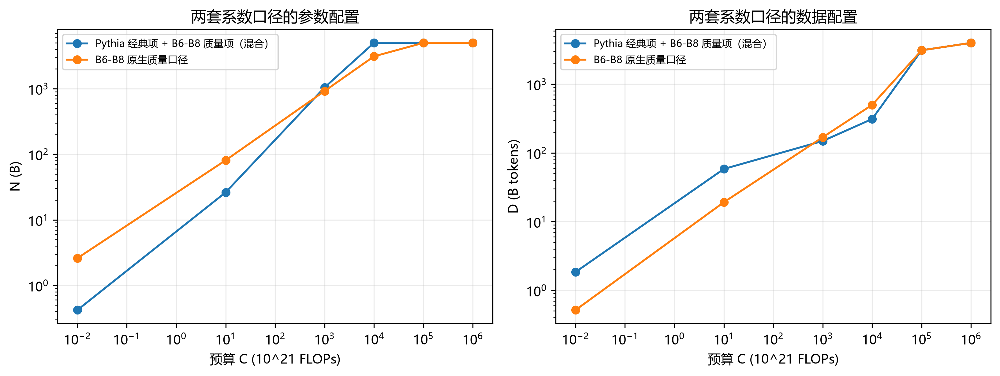

## 4 结果

### 4.1 主口径六档预算

| budget_1e21 | context_tokens | N_params_B | D_tokens_B | Q_target | loss | train_cost_share | quality_cost_share | attention_cost_share |
| --- | --- | --- | --- | --- | --- | --- | --- | --- |
| 0.0100 | 2048 | 0.4211 | 1.8455 | 0.9500 | 3.3087 | 0.4663 | 0.5019 | 0.0318 |
| 10.0000 | 2048 | 26.2925 | 58.3963 | 0.9500 | 2.1296 | 0.9212 | 0.0159 | 0.0629 |
| 1000.0000 | 2048 | 1045.1862 | 149.2104 | 0.9500 | 1.6739 | 0.9357 | 0.0004 | 0.0639 |
| 10000.0000 | 2048 | 5000.0000 | 312.0055 | 0.9500 | 1.4865 | 0.9360 | 0.0001 | 0.0639 |
| 100000.0000 | 2048 | 5000.0000 | 3120.0548 | 0.9500 | 1.3656 | 0.9360 | 0.0001 | 0.0639 |
| 1000000.0000 | 8192 | 5000.0000 | 4000.0000 | 0.9500 | 1.3566 | 0.7854 | 0.0001 | 0.2145 |

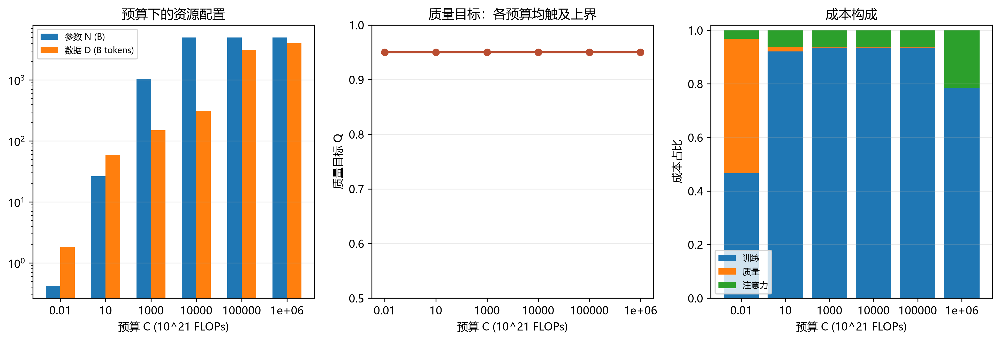

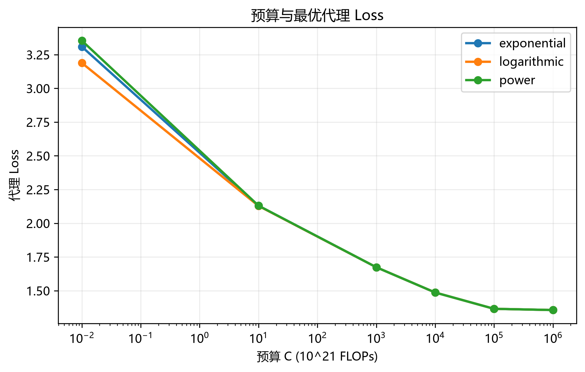

Q 在六档预算均为 0.95，主模型没有识别到质量内点。低预算质量成本占比较高；部分高预算情景触及 5000B 上界，必须解释为边界设定加成本函数结构效应，而非架构规律。expanded 边界放宽结果见 4.4。

### 4.2 质量成本与参数口径敏感性

| coefficient_source | budget_1e21 | cost_function | N_params_B | D_tokens_B | Q_target | loss |
| --- | --- | --- | --- | --- | --- | --- |
| b1 | 0.0100 | exponential | 0.4211 | 1.8455 | 0.9500 | 3.3087 |
| b1 | 0.0100 | logarithmic | 0.2561 | 3.8403 | 0.9500 | 3.1883 |
| b1 | 0.0100 | power | 0.4890 | 1.4808 | 0.9500 | 3.3535 |
| b1 | 10.0000 | exponential | 26.2925 | 58.3963 | 0.9500 | 2.1296 |
| b1 | 10.0000 | logarithmic | 25.7323 | 60.2786 | 0.9500 | 2.1285 |
| b1 | 10.0000 | power | 26.5727 | 57.4914 | 0.9500 | 2.1302 |
| b1 | 1000.0000 | exponential | 1045.1862 | 149.2104 | 0.9500 | 1.6739 |
| b1 | 1000.0000 | logarithmic | 1044.6042 | 149.3327 | 0.9500 | 1.6738 |
| b1 | 1000.0000 | power | 1045.4809 | 149.1484 | 0.9500 | 1.6739 |
| b1 | 10000.0000 | exponential | 5000.0000 | 312.0055 | 0.9500 | 1.4865 |
| b1 | 10000.0000 | logarithmic | 5000.0000 | 312.0226 | 0.9500 | 1.4865 |
| b1 | 10000.0000 | power | 5000.0000 | 311.9967 | 0.9500 | 1.4865 |
| b1 | 100000.0000 | exponential | 5000.0000 | 3120.0548 | 0.9500 | 1.3656 |
| b1 | 100000.0000 | logarithmic | 5000.0000 | 3120.2258 | 0.9500 | 1.3656 |
| b1 | 100000.0000 | power | 5000.0000 | 3119.9672 | 0.9500 | 1.3656 |
| b6_b8_lambda10 | 0.0100 | exponential | 2.6006 | 0.5158 | 0.9500 | 1.3642 |
| b6_b8_lambda10 | 0.0100 | logarithmic | 2.2836 | 0.6410 | 0.9500 | 1.3469 |
| b6_b8_lambda10 | 0.0100 | power | 2.7437 | 0.4716 | 0.9500 | 1.3721 |
| b6_b8_lambda10 | 10.0000 | exponential | 81.0584 | 19.1471 | 0.9500 | 0.5947 |
| b6_b8_lambda10 | 10.0000 | logarithmic | 80.6554 | 19.3076 | 0.9500 | 0.5945 |
| b6_b8_lambda10 | 10.0000 | power | 81.2639 | 19.0662 | 0.9500 | 0.5948 |
| b6_b8_lambda10 | 1000.0000 | exponential | 921.1991 | 169.2839 | 0.9500 | 0.3556 |
| b6_b8_lambda10 | 1000.0000 | logarithmic | 920.7961 | 169.4083 | 0.9500 | 0.3556 |
| b6_b8_lambda10 | 1000.0000 | power | 921.4125 | 169.2189 | 0.9500 | 0.3556 |
| b6_b8_lambda10 | 10000.0000 | exponential | 3115.0107 | 500.7839 | 0.9500 | 0.2784 |
| b6_b8_lambda10 | 10000.0000 | logarithmic | 3114.6578 | 500.8847 | 0.9500 | 0.2784 |
| b6_b8_lambda10 | 10000.0000 | power | 3115.2036 | 500.7304 | 0.9500 | 0.2784 |
| b6_b8_lambda10 | 100000.0000 | exponential | 5000.0000 | 3120.0548 | 0.9500 | 0.2234 |
| b6_b8_lambda10 | 100000.0000 | logarithmic | 5000.0000 | 3120.2258 | 0.9500 | 0.2234 |
| b6_b8_lambda10 | 100000.0000 | power | 5000.0000 | 3119.9672 | 0.9500 | 0.2234 |

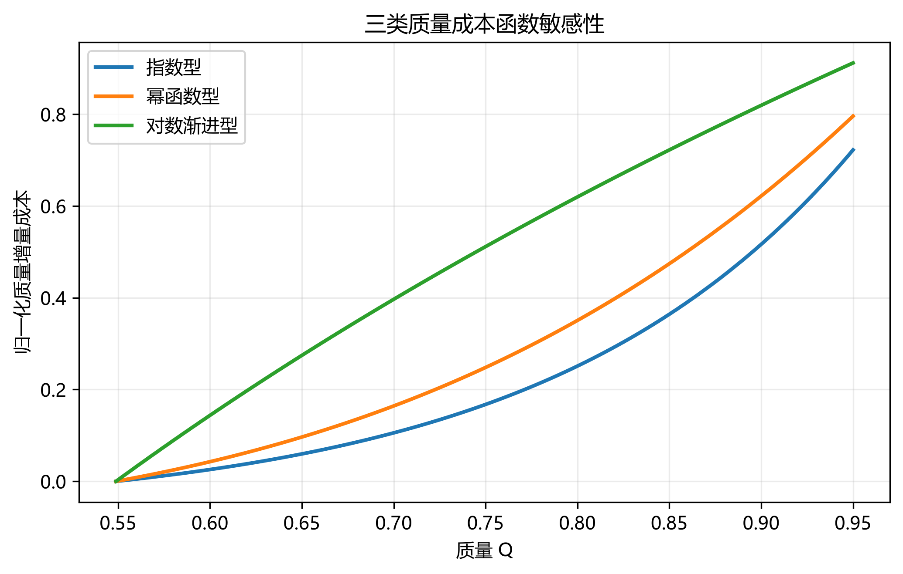

### 4.3 上下文与注意力成本

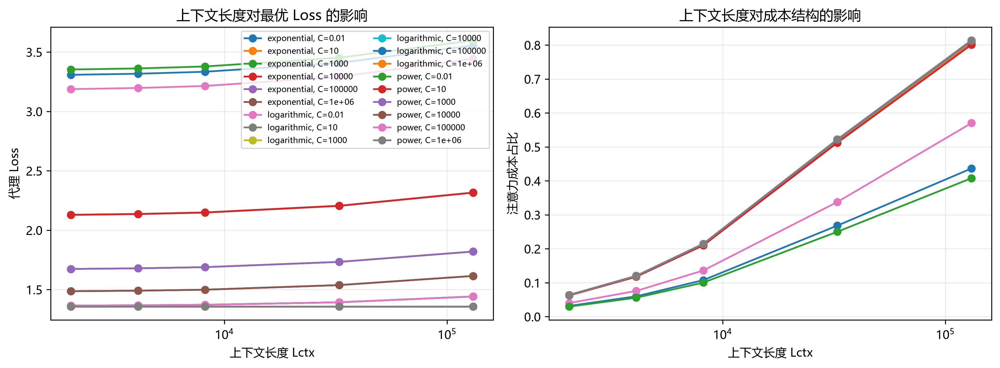

| context_tokens | N_params_B | D_tokens_B | Q_target | loss | attention_cost_share |
| --- | --- | --- | --- | --- | --- |
| 2048 | 26.2925 | 58.3963 | 0.9500 | 2.1296 | 0.0629 |
| 4096 | 25.0010 | 57.7347 | 0.9500 | 2.1365 | 0.1182 |
| 8192 | 22.7983 | 56.5413 | 0.9500 | 2.1492 | 0.2112 |
| 32768 | 15.2250 | 51.5869 | 0.9500 | 2.2056 | 0.5147 |
| 131072 | 7.0833 | 43.3081 | 0.9500 | 2.3168 | 0.8042 |

由模型定义式 Lctx^crit=6/η，题设给定 η=2×10^-4 时得到 30000。η 敏感性为：

| eta | critical_context_tokens |
| --- | --- |
| 0.0001 | 60000.0000 |
| 0.0002 | 30000.0000 |
| 0.0004 | 15000.0000 |
| 0.0008 | 7500.0000 |

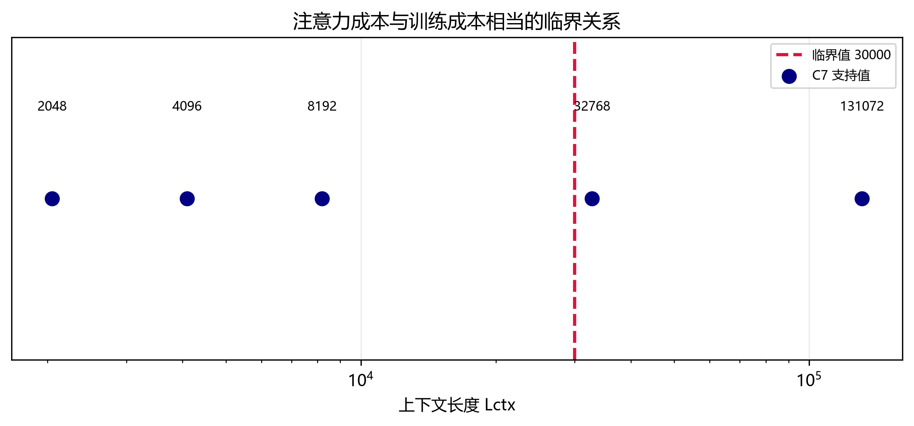

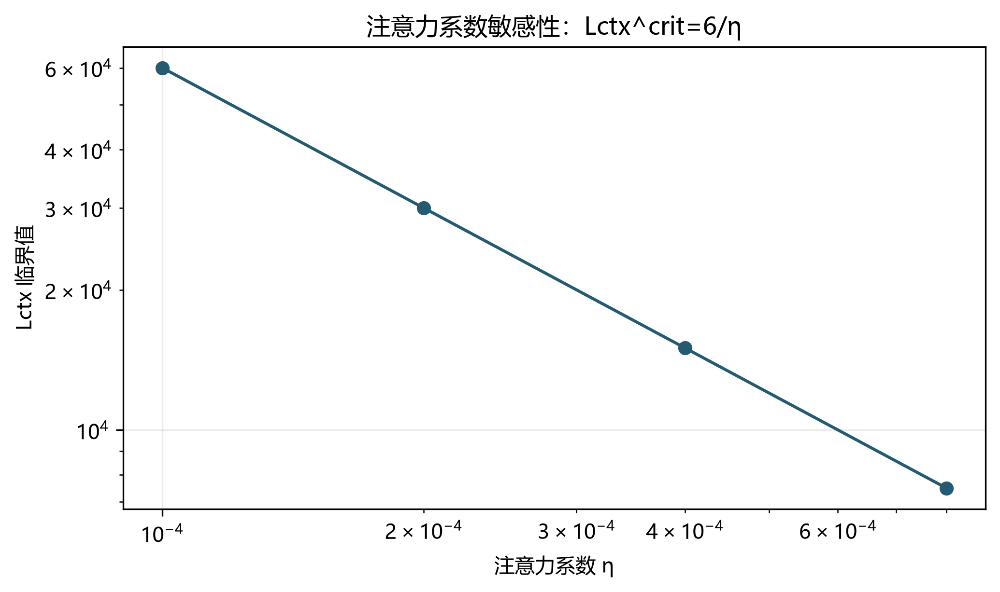

9 个预算与成本条件的选择均落在 2048，是代理损失缺少长文本收益项导致的最短上下文边界解，不能推广为真实训练中 2048 普遍最优。

### 4.4 边界放宽与结构转移

| coefficient_source | budget_1e21 | N_params_B | D_tokens_B | Q_target | loss |
| --- | --- | --- | --- | --- | --- |
| b6_b8_lambda10 | 0.0100 | 2.6006 | 0.5158 | 0.9500 | 1.3642 |
| b6_b8_lambda10 | 10.0000 | 81.0592 | 19.1469 | 0.9500 | 0.5947 |
| b6_b8_lambda10 | 1000.0000 | 921.1991 | 169.2839 | 0.9500 | 0.3556 |
| b6_b8_lambda10 | 10000.0000 | 3115.0031 | 500.7852 | 0.9500 | 0.2784 |
| b6_b8_lambda10 | 100000.0000 | 5000.0000 | 3120.0548 | 0.9500 | 0.2234 |
| b6_b8_lambda10 | 1000000.0000 | 5000.0000 | 4000.0000 | 0.9500 | 0.2191 |
| b1 | 0.0100 | 0.4211 | 1.8455 | 0.9500 | 3.3087 |
| b1 | 10.0000 | 26.2925 | 58.3963 | 0.9500 | 2.1296 |
| b1 | 1000.0000 | 1045.1862 | 149.2104 | 0.9500 | 1.6739 |
| b1 | 10000.0000 | 5000.0000 | 312.0055 | 0.9500 | 1.4865 |
| b1 | 100000.0000 | 5000.0000 | 3120.0548 | 0.9500 | 1.3656 |
| b1 | 1000000.0000 | 5000.0000 | 4000.0000 | 0.9500 | 1.3566 |

放宽到 N≤5000、D≤4000 后，高预算解若仍贴近 N 上界，则只能说明边界依赖；若回到内点，才可把旧边界激活视为数值约束影响。成本份额的跨预算转移如下：

| coefficient_source | boundary_scheme | cost_function | budget_from_1e21 | budget_to_1e21 | delta_N_B | delta_D_B | delta_Q | delta_train_share | delta_quality_share | delta_attention_share | loss_drop | share_total_variation | N_upper_active_after | Q_upper_active_both |
| --- | --- | --- | --- | --- | --- | --- | --- | --- | --- | --- | --- | --- | --- | --- |
| b1 | expanded | exponential | 0.0100 | 10.0000 | 25.8714 | 56.5508 | -0.0000 | 0.4549 | -0.4860 | 0.0311 | 1.1791 | 0.4860 | False | True |
| b1 | expanded | exponential | 10.0000 | 1000.0000 | 1018.8937 | 90.8141 | -0.0000 | 0.0145 | -0.0155 | 0.0010 | 0.4558 | 0.0155 | True | True |
| b1 | expanded | exponential | 1000.0000 | 10000.0000 | 3954.8138 | 162.7951 | -0.0000 | 0.0003 | -0.0003 | 0.0000 | 0.1874 | 0.0003 | True | True |
| b1 | expanded | exponential | 10000.0000 | 100000.0000 | -0.0000 | 2808.0493 | 0.0000 | 0.0000 | 0.0000 | 0.0000 | 0.1209 | 0.0000 | True | True |
| b1 | expanded | exponential | 100000.0000 | 1000000.0000 | 0.0000 | 879.9452 | 0.0000 | -0.1506 | -0.0000 | 0.1506 | 0.0090 | 0.1506 | True | True |
| b1 | expanded | logarithmic | 0.0100 | 10.0000 | 25.4762 | 56.4383 | -0.0000 | 0.3407 | -0.3639 | 0.0233 | 1.0598 | 0.3639 | False | True |
| b1 | expanded | logarithmic | 10.0000 | 1000.0000 | 1018.8719 | 89.0541 | -0.0000 | 0.0053 | -0.0057 | 0.0004 | 0.4546 | 0.0057 | True | True |
| b1 | expanded | logarithmic | 1000.0000 | 10000.0000 | 3955.3958 | 162.6899 | 0.0000 | 0.0001 | -0.0001 | 0.0000 | 0.1873 | 0.0001 | True | True |
| b1 | expanded | logarithmic | 10000.0000 | 100000.0000 | 0.0000 | 2808.2032 | 0.0000 | 0.0000 | 0.0000 | 0.0000 | 0.1209 | 0.0000 | True | True |
| b1 | expanded | logarithmic | 100000.0000 | 1000000.0000 | -0.0000 | 879.7742 | -0.0000 | -0.4581 | -0.0000 | 0.4581 | 0.0090 | 0.4581 | True | True |
| b1 | expanded | power | 0.0100 | 10.0000 | 26.0837 | 56.0106 | -0.0000 | 0.4822 | -0.5151 | 0.0329 | 1.2233 | 0.5151 | False | True |
| b1 | expanded | power | 10.0000 | 1000.0000 | 1018.9082 | 91.6570 | -0.0000 | 0.0190 | -0.0203 | 0.0013 | 0.4563 | 0.0203 | True | True |
| b1 | expanded | power | 1000.0000 | 10000.0000 | 3954.5191 | 162.8484 | 0.0000 | 0.0004 | -0.0004 | 0.0000 | 0.1874 | 0.0004 | True | True |
| b1 | expanded | power | 10000.0000 | 100000.0000 | 0.0000 | 2807.9705 | 0.0000 | 0.0000 | -0.0000 | -0.0000 | 0.1209 | 0.0000 | True | True |
| b1 | expanded | power | 100000.0000 | 1000000.0000 | -0.0000 | 880.0328 | -0.0000 | -0.1506 | -0.0000 | 0.1506 | 0.0090 | 0.1506 | True | True |
| b1 | legacy | exponential | 0.0100 | 10.0000 | 25.8714 | 56.5508 | -0.0000 | 0.4549 | -0.4860 | 0.0311 | 1.1791 | 0.4860 | False | True |
| b1 | legacy | exponential | 10.0000 | 1000.0000 | 973.7075 | 97.5535 | 0.0000 | 0.0145 | -0.0155 | 0.0010 | 0.4557 | 0.0155 | True | True |
| b1 | legacy | exponential | 1000.0000 | 10000.0000 | 0.0000 | 1403.5483 | -0.0000 | -0.0000 | -0.0000 | 0.0000 | 0.1464 | 0.0000 | True | True |
| b1 | legacy | exponential | 10000.0000 | 100000.0000 | -0.0000 | 3440.5019 | -0.0000 | 0.0000 | 0.0000 | 0.0000 | 0.0453 | 0.0000 | True | True |
| b1 | legacy | exponential | 100000.0000 | 1000000.0000 | 0.0000 | 0.0000 | 0.0000 | -0.4579 | -0.0002 | 0.4581 | 0.0000 | 0.4581 | True | True |
| b1 | legacy | logarithmic | 0.0100 | 10.0000 | 25.4762 | 56.4383 | -0.0000 | 0.3407 | -0.3639 | 0.0233 | 1.0598 | 0.3639 | False | True |
| b1 | legacy | logarithmic | 10.0000 | 1000.0000 | 974.2677 | 95.7140 | 0.0000 | 0.0053 | -0.0057 | 0.0004 | 0.4546 | 0.0057 | True | True |
| b1 | legacy | logarithmic | 1000.0000 | 10000.0000 | 0.0000 | 1403.9329 | -0.0000 | 0.0000 | -0.0000 | 0.0000 | 0.1464 | 0.0000 | True | True |
| b1 | legacy | logarithmic | 10000.0000 | 100000.0000 | 0.0000 | 3440.0745 | 0.0000 | 0.0000 | 0.0000 | 0.0000 | 0.0453 | 0.0000 | True | True |
| b1 | legacy | logarithmic | 100000.0000 | 1000000.0000 | -0.0000 | 0.0000 | 0.0000 | -0.4580 | -0.0001 | 0.4581 | 0.0000 | 0.4581 | True | True |
| b1 | legacy | power | 0.0100 | 10.0000 | 26.0837 | 56.0106 | -0.0000 | 0.4822 | -0.5151 | 0.0329 | 1.2233 | 0.5151 | False | True |
| b1 | legacy | power | 10.0000 | 1000.0000 | 973.4273 | 98.4366 | -0.0000 | 0.0189 | -0.0202 | 0.0013 | 0.4563 | 0.0202 | True | True |
| b1 | legacy | power | 1000.0000 | 10000.0000 | -0.0000 | 1403.3515 | 0.0000 | 0.0000 | 0.0000 | 0.0000 | 0.1464 | 0.0000 | True | True |
| b1 | legacy | power | 10000.0000 | 100000.0000 | 0.0000 | 3440.7206 | 0.0000 | -0.1504 | -0.0001 | 0.1505 | 0.0453 | 0.1505 | True | True |
| b1 | legacy | power | 100000.0000 | 1000000.0000 | -0.0000 | -0.0000 | 0.0000 | -0.3073 | -0.0002 | 0.3075 | 0.0000 | 0.3075 | True | True |
| b6_b8_lambda10 | expanded | exponential | 0.0100 | 10.0000 | 78.4577 | 18.6314 | 0.0000 | 0.1264 | -0.1351 | 0.0086 | 0.7695 | 0.1351 | False | True |
| b6_b8_lambda10 | expanded | exponential | 10.0000 | 1000.0000 | 840.1407 | 150.1367 | 0.0000 | 0.0044 | -0.0047 | 0.0003 | 0.2391 | 0.0047 | False | True |
| b6_b8_lambda10 | expanded | exponential | 1000.0000 | 10000.0000 | 2193.8116 | 331.5001 | -0.0000 | 0.0003 | -0.0003 | 0.0000 | 0.0771 | 0.0003 | True | True |
| b6_b8_lambda10 | expanded | exponential | 10000.0000 | 100000.0000 | 1884.9893 | 2619.2708 | 0.0000 | 0.0000 | -0.0001 | 0.0000 | 0.0551 | 0.0001 | True | True |
| b6_b8_lambda10 | expanded | exponential | 100000.0000 | 1000000.0000 | 0.0000 | 879.9452 | -0.0000 | -0.1506 | -0.0000 | 0.1506 | 0.0043 | 0.1506 | True | True |
| b6_b8_lambda10 | expanded | logarithmic | 0.0100 | 10.0000 | 78.3719 | 18.6665 | 0.0000 | 0.0560 | -0.0599 | 0.0038 | 0.7524 | 0.0599 | False | True |
| b6_b8_lambda10 | expanded | logarithmic | 10.0000 | 1000.0000 | 840.1407 | 150.1008 | 0.0000 | 0.0016 | -0.0017 | 0.0001 | 0.2389 | 0.0017 | False | True |
| b6_b8_lambda10 | expanded | logarithmic | 1000.0000 | 10000.0000 | 2193.8617 | 331.4764 | -0.0000 | 0.0001 | -0.0001 | 0.0000 | 0.0771 | 0.0001 | True | True |
| b6_b8_lambda10 | expanded | logarithmic | 10000.0000 | 100000.0000 | 1885.3422 | 2619.3411 | -0.0000 | 0.0000 | -0.0000 | 0.0000 | 0.0551 | 0.0000 | True | True |
| b6_b8_lambda10 | expanded | logarithmic | 100000.0000 | 1000000.0000 | 0.0000 | 879.7742 | 0.0000 | -0.1506 | -0.0000 | 0.1506 | 0.0043 | 0.1506 | True | True |
| b6_b8_lambda10 | expanded | power | 0.0100 | 10.0000 | 78.5203 | 18.5946 | -0.0000 | 0.1533 | -0.1638 | 0.0105 | 0.7772 | 0.1638 | False | True |
| b6_b8_lambda10 | expanded | power | 10.0000 | 1000.0000 | 840.1486 | 150.1527 | 0.0000 | 0.0059 | -0.0063 | 0.0004 | 0.2392 | 0.0063 | False | True |
| b6_b8_lambda10 | expanded | power | 1000.0000 | 10000.0000 | 2193.7911 | 331.5114 | 0.0000 | 0.0004 | -0.0004 | 0.0000 | 0.0772 | 0.0004 | True | True |
| b6_b8_lambda10 | expanded | power | 10000.0000 | 100000.0000 | 1884.7964 | 2619.2369 | -0.0000 | 0.0001 | -0.0001 | 0.0000 | 0.0551 | 0.0001 | True | True |
| b6_b8_lambda10 | expanded | power | 100000.0000 | 1000000.0000 | 0.0000 | 880.0328 | -0.0000 | -0.1506 | -0.0000 | 0.1506 | 0.0043 | 0.1506 | True | True |
| b6_b8_lambda10 | legacy | exponential | 0.0100 | 10.0000 | 78.4577 | 18.6314 | 0.0000 | 0.1264 | -0.1351 | 0.0086 | 0.7695 | 0.1351 | False | True |
| b6_b8_lambda10 | legacy | exponential | 10.0000 | 1000.0000 | 840.1513 | 150.1348 | -0.0000 | 0.0044 | -0.0047 | 0.0003 | 0.2391 | 0.0047 | False | True |
| b6_b8_lambda10 | legacy | exponential | 1000.0000 | 10000.0000 | 78.7904 | 1390.2162 | 0.0000 | 0.0000 | -0.0000 | 0.0000 | 0.0679 | 0.0000 | True | True |
| b6_b8_lambda10 | legacy | exponential | 10000.0000 | 100000.0000 | 0.0000 | 3440.5019 | 0.0000 | -0.0562 | -0.0000 | 0.0562 | 0.0216 | 0.0562 | True | True |
| b6_b8_lambda10 | legacy | exponential | 100000.0000 | 1000000.0000 | 0.0000 | 0.0000 | 0.0000 | -0.0943 | -0.0000 | 0.0943 | 0.0000 | 0.0943 | True | True |
| b6_b8_lambda10 | legacy | logarithmic | 0.0100 | 10.0000 | 78.3719 | 18.6665 | 0.0000 | 0.0560 | -0.0599 | 0.0038 | 0.7524 | 0.0599 | False | True |
| b6_b8_lambda10 | legacy | logarithmic | 10.0000 | 1000.0000 | 840.1459 | 150.0998 | 0.0000 | 0.0016 | -0.0017 | 0.0001 | 0.2389 | 0.0017 | False | True |
| b6_b8_lambda10 | legacy | logarithmic | 1000.0000 | 10000.0000 | 79.1986 | 1390.5181 | 0.0000 | 0.0000 | -0.0000 | 0.0000 | 0.0679 | 0.0000 | True | True |
| b6_b8_lambda10 | legacy | logarithmic | 10000.0000 | 100000.0000 | 0.0000 | 3440.0745 | -0.0000 | -0.4580 | -0.0001 | 0.4581 | 0.0216 | 0.4581 | True | True |
| b6_b8_lambda10 | legacy | logarithmic | 100000.0000 | 1000000.0000 | 0.0000 | 0.0000 | 0.0000 | 0.3075 | 0.0000 | -0.3075 | 0.0000 | 0.3075 | True | True |
| b6_b8_lambda10 | legacy | power | 0.0100 | 10.0000 | 78.5203 | 18.5946 | -0.0000 | 0.1533 | -0.1638 | 0.0105 | 0.7772 | 0.1638 | False | True |
| b6_b8_lambda10 | legacy | power | 10.0000 | 1000.0000 | 840.1464 | 150.1531 | 0.0000 | 0.0059 | -0.0063 | 0.0004 | 0.2392 | 0.0063 | False | True |
| b6_b8_lambda10 | legacy | power | 1000.0000 | 10000.0000 | 78.5897 | 1390.0601 | 0.0000 | 0.0000 | -0.0000 | 0.0000 | 0.0679 | 0.0000 | True | True |
| b6_b8_lambda10 | legacy | power | 10000.0000 | 100000.0000 | 0.0000 | 3440.7206 | -0.0000 | -0.0562 | -0.0000 | 0.0562 | 0.0216 | 0.0562 | True | True |
| b6_b8_lambda10 | legacy | power | 100000.0000 | 1000000.0000 | 0.0000 | 0.0000 | 0.0000 | -0.0943 | -0.0001 | 0.0943 | 0.0000 | 0.0943 | True | True |

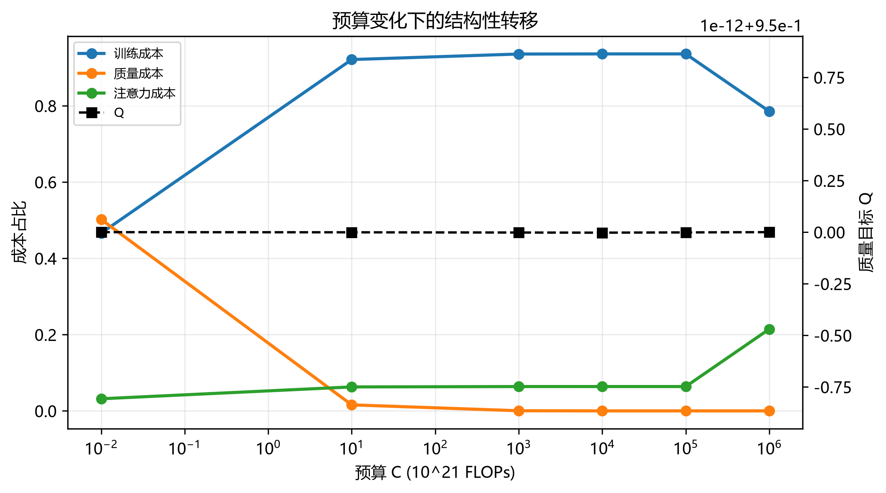

### 4.5 配比重塑

配比使用 p_i≥0.001 的下界。下表给出基线 p0、最优 share 与倍数 share/p0：

| domain | p0 | share | share_multiple |
| --- | --- | --- | --- |
| enron_emails | 0.0022 | 0.0256 | 11.5815 |
| nih_exporter | 0.0059 | 0.0266 | 4.5187 |
| hackernews | 0.0117 | 0.0312 | 2.6815 |
| philpapers | 0.0055 | 0.0127 | 2.3101 |
| arxiv | 0.1130 | 0.2419 | 2.1407 |
| ubuntu_irc | 0.0196 | 0.0391 | 1.9965 |
| stackexchange | 0.0994 | 0.1620 | 1.6292 |
| freelaw | 0.0968 | 0.1294 | 1.3362 |
| pubmed_central | 0.1138 | 0.1499 | 1.3178 |
| gutenberg_pg_19 | 0.0469 | 0.0323 | 0.6876 |
| wikipedia_en | 0.0751 | 0.0452 | 0.6017 |
| dm_mathematics | 0.0255 | 0.0114 | 0.4460 |
| pubmed_abstracts | 0.0662 | 0.0253 | 0.3817 |
| github | 0.1107 | 0.0351 | 0.3170 |
| uspto_backgrounds | 0.0756 | 0.0221 | 0.2927 |
| europarl | 0.0127 | 0.0011 | 0.0825 |
| pile_cc | 0.1195 | 0.0092 | 0.0770 |

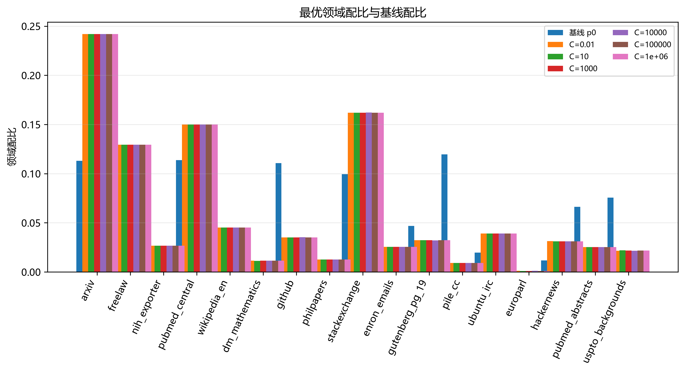

施加 p_i≥0.001 下界后，本次主口径实测的典型倍数由导出表给出（例如 pile_cc、europarl 约降至基线的 0.08，github 约 0.32，enron 约 11.6，arxiv 约 2.1）；下界会压缩无约束优化可能出现的极端倍数。跨预算结构高度稳定，但相对 p0 的 KL 可约 0.35 nats，二者并不矛盾。主项系数与 KL 系数分别做 1/5、1、5 倍敏感性：

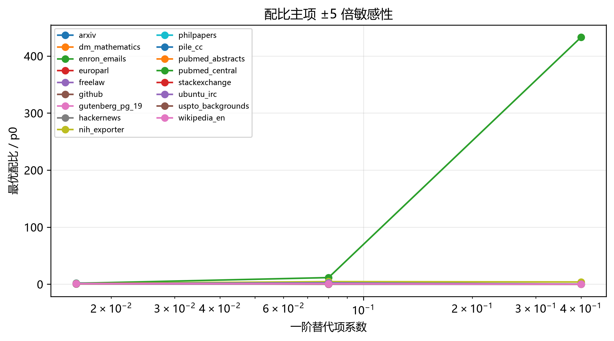

### 4.6 二阶非加性

| loss_domain | domain_a | domain_b | donor_domain | nonadditive_delta_loss |
| --- | --- | --- | --- | --- |
| metric/the_pile_github_val_loss | stackexchange | github | pile_cc | 0.2487 |
| metric/the_pile_stackexchange_val_loss | stackexchange | github | pile_cc | 0.1919 |
| metric/the_pile_arxiv_val_loss | stackexchange | arxiv | github | 0.1661 |
| metric/the_pile_wikipedia_en_val_loss | wikipedia_en | pile_cc | github | 0.1299 |
| metric/the_pile_dm_mathematics_val_loss | freelaw | pubmed_central | arxiv | -0.1181 |

这些记录来自独立测试二次模型预测的二阶差分，符号不代表实验因果机制。

### 4.7 参数不确定性传播

对六参数至少 200 次抽样，传播到 N、D、Q 与三类成本份额；区间采用 2.5%--97.5% 分位数。

| coefficient_source | budget_1e21 | N_params_B_median | N_params_B_ci_low | N_params_B_ci_high | D_tokens_B_median | D_tokens_B_ci_low | D_tokens_B_ci_high | Q_target_median | Q_target_ci_low | Q_target_ci_high | train_cost_share_median | quality_cost_share_median | attention_cost_share_median |
| --- | --- | --- | --- | --- | --- | --- | --- | --- | --- | --- | --- | --- | --- |
| b1 | 0.0100 | 0.4214 | 0.3938 | 0.4505 | 1.8460 | 1.7836 | 1.9302 | 0.9500 | 0.9423 | 0.9500 | 0.4670 | 0.5011 | 0.0319 |
| b1 | 10.0000 | 25.8462 | 23.5853 | 27.7426 | 59.3883 | 55.3900 | 64.9809 | 0.9500 | 0.9500 | 0.9500 | 0.9210 | 0.0162 | 0.0629 |
| b1 | 1000.0000 | 1020.1850 | 930.1949 | 1102.8181 | 152.8655 | 141.4159 | 167.6476 | 0.9500 | 0.9500 | 0.9500 | 0.9357 | 0.0004 | 0.0639 |
| b6_b8_lambda10 | 0.0100 | 2.5831 | 2.1825 | 3.2364 | 0.5188 | 0.4262 | 0.5985 | 0.9500 | 0.9500 | 0.9500 | 0.8040 | 0.1411 | 0.0549 |
| b6_b8_lambda10 | 10.0000 | 81.0404 | 69.7501 | 94.5649 | 19.1514 | 16.4246 | 22.2326 | 0.9500 | 0.9500 | 0.9500 | 0.9312 | 0.0052 | 0.0636 |
| b6_b8_lambda10 | 1000.0000 | 925.7160 | 786.4527 | 1081.1216 | 168.4583 | 144.2530 | 198.2724 | 0.9500 | 0.9500 | 0.9500 | 0.9357 | 0.0005 | 0.0639 |

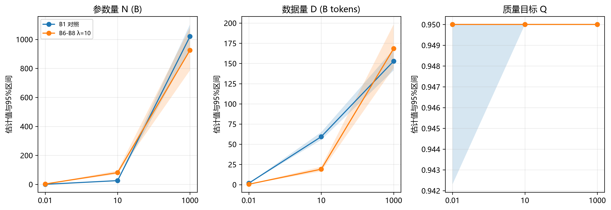

## 5 模型检验与敏感性

### 5.1 质量成本校准

当前 κ_Q=1 未由硬件实测识别，scale 网格扩展到覆盖 Q 脱离 0.95 的转折区间：

| quality_cost_scale | Q_target | N_params_B | D_tokens_B | quality_cost_share | loss |
| --- | --- | --- | --- | --- | --- |
| 0.3000 | 0.9500 | 25.6847 | 60.4433 | 0.0049 | 2.1284 |
| 1.0000 | 0.9500 | 26.2925 | 58.3963 | 0.0159 | 2.1296 |
| 3.0000 | 0.9500 | 27.9285 | 53.4276 | 0.0436 | 2.1331 |
| 10.0000 | 0.9500 | 32.8569 | 42.0532 | 0.1144 | 2.1438 |
| 30.0000 | 0.9500 | 43.6539 | 27.6712 | 0.2257 | 2.1678 |
| 100.0000 | 0.9500 | 69.5549 | 13.9322 | 0.3789 | 2.2233 |
| 300.0000 | 0.9500 | 118.6507 | 6.3438 | 0.5175 | 2.3159 |
| 1000.0000 | 0.9500 | 230.7095 | 2.3820 | 0.6478 | 2.4847 |
| 3000.0000 | 0.5488 | 25.4178 | 61.3807 | 0.0000 | 2.5957 |
| 10000.0000 | 0.5488 | 25.4177 | 61.3809 | 0.0000 | 2.5957 |
| 30000.0000 | 0.5488 | 25.4176 | 61.3812 | 0.0000 | 2.5957 |
| 100000.0000 | 0.5488 | 25.4176 | 61.3812 | 0.0000 | 2.5957 |
| 1000000.0000 | 0.5488 | 25.4177 | 61.3810 | 0.0000 | 2.5957 |

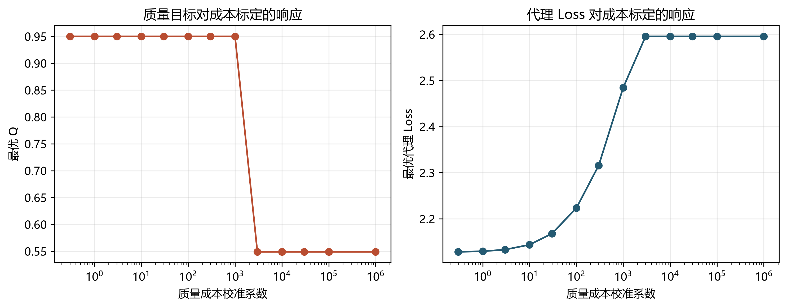

若 Q 在全网格仍贴边，结论只能是当前校准下优先提质；候选成因包括清洗成本相对训练通量过小、收益项形式缺失、γ 量级偏大，均需额外数据验证。

### 5.2 约束与接口检查

优化结果逐行检查预算约束、p 行和、p_i 下界和 Q 上界。A4 基线按行闭合后取均值；所有二阶组合均保留来源标签。B1 的 α、β 已用 bootstrap 给出区间，Q2 的 γ、θ 使用 λ=10 行的区间。

## 6 局限性与推广

Q1 插补误差、Q2 口径桥接误差和硬件吞吐尚未由同一联合实验识别。下一步可用真实计时校准 η 与 κ_Q，把 Q1 质量向量的插补方差纳入层次模型，并在有成对配方观测后估计 p 的二阶项。

## 7 结论

主口径重算后，Q 恒卡在 0.95，质量维度的内点权衡不可识别；部分高预算情景的 N 上界激活是边界设定和成本结构的共同结果。长上下文使注意力开销按 ηLctx/6 放大，参数规模受到更强挤压，代理模型倾向优先保数据吞吐。在本代理模型和题设成本函数条件下，得到的规律性结论是：长上下文算力挤压具有非对称性，参数规模相对更易被压缩；该判断需用长文本训练计时和收益项补充实验验证，不能作为脱离校准条件的工程定律。

## 参考文献

1. Kaplan et al. *Scaling Laws for Neural Language Models*, 2020.
2. Hoffmann et al. *Training Compute-Optimal Large Language Models*, NeurIPS, 2022.
3. Xia et al. *RegMix: Data Mixture as Regression for Language Model Pre-training*, ICML, 2024.
4. Biderman et al. *Pythia: A Suite for Analyzing Large Language Models Across Training and Scaling*, ICML, 2023.
5. Bahri et al. *Explaining neural scaling laws*, PNAS, 2024.

## 数据交付

所有 CSV、图片和本文由 `f_question.q3` 重跑生成，原始数据集不复制到输出目录。
