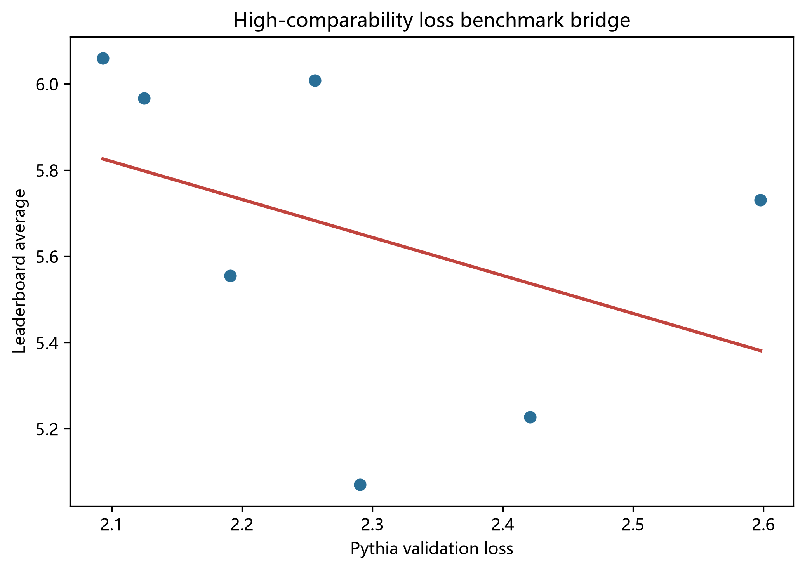
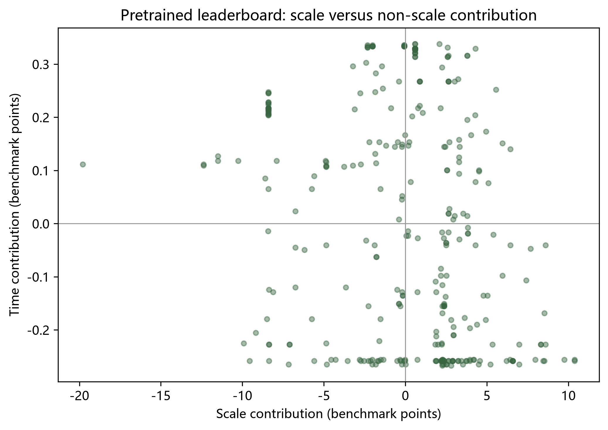
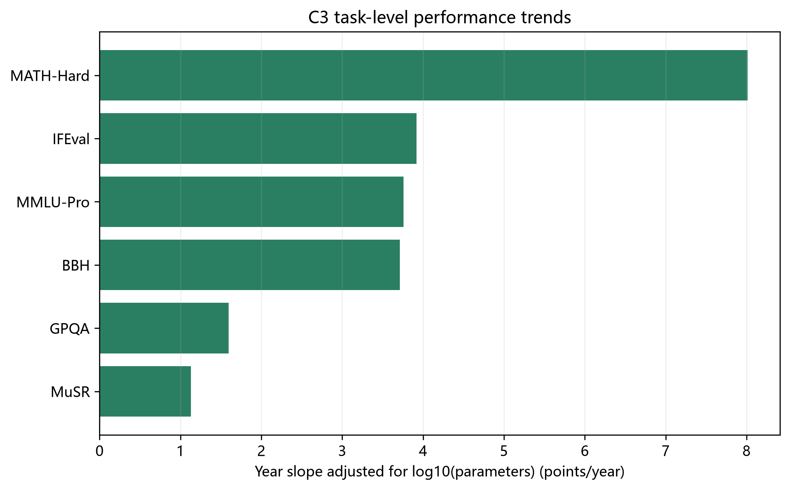
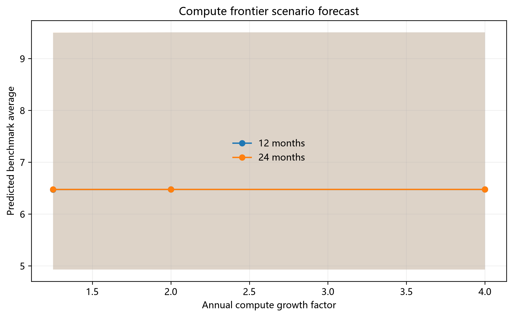
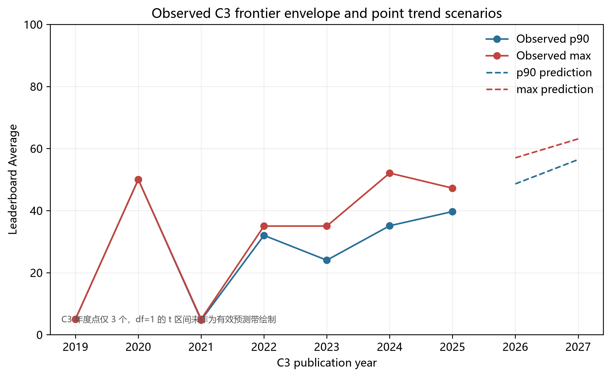
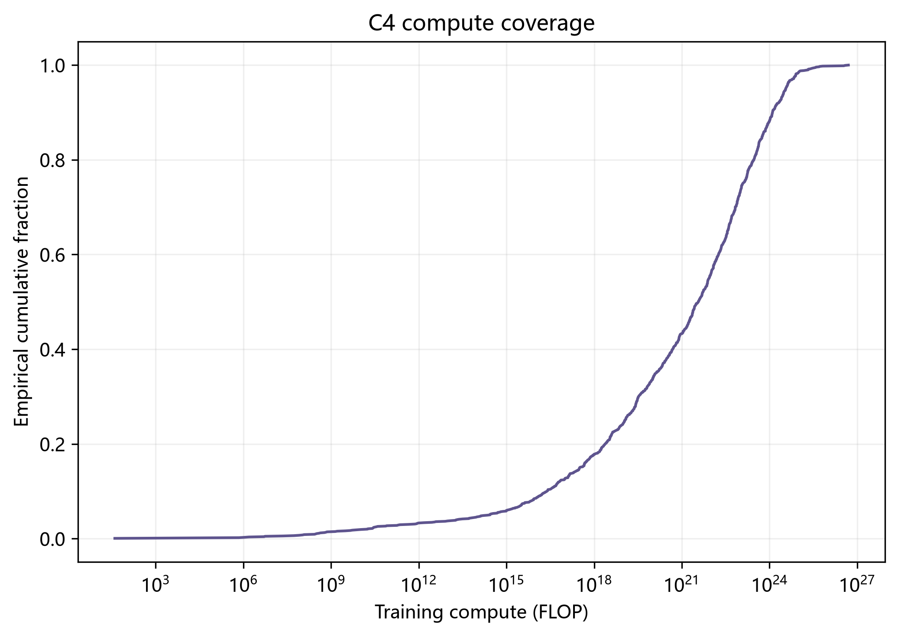

# 问题四 模型效率前沿与规模技术进步分解

## 摘要

本问研究训练计算预算、模型规模与榜单能力之间的关系，并把观测到的能力提升分解为规模扩张与时间相关的非规模技术进步。Loss 到 benchmark 的桥接只使用 C6 中 7 个 High 可比 Pythia 配对点，得到仿射关系 LB_Average = 7.6717 − 0.8817 Loss，R²=0.1580，F 检验 p=0.3773。高可比样本只有 7/75，区间很宽，因此桥接可作为可检验假设和情景工具，不能视为普适定标。

C4 中有 1,390 条记录含有效训练 FLOP，最大值为 5.000e+26。C1 严格筛选得到 333 条 pretrained 记录，其中 330 条进入规模—时间回归。该回归 R²=0.3594。以 Shapley 方差归因为主口径，规模、时间与残差份额分别为 35.2%、0.7% 与 64.1%。同时使用 C8 逐任务记录和 C3 年度榜单序列刻画任务异质性；Q3 前沿超出 Loss 桥接支持区间的预测均标为域外外推。

## 1 问题重述与数据边界

第四问把前三问显式接口接到 C1、C3、C4、C6。Q4 的 Loss 口径固定为 Pythia validation loss，并通过 `outputs/q4_input_contract.json` 读取 Q3 连续 `Loss*(C)`；The Pile Loss、Pythia `val_loss` 与半合成 `Q_score` 不直接混用。C8 共解析 1,954 份有效 JSON，聚合得到 11,784 条模型—任务分数，覆盖 1,861 个模型；其中 99.9% 的有效模型标识与 C1 精确规范化匹配。C1 原表共 4,576 条记录，严格筛选得到 333 条 pretrained 记录，其中 330 条完整记录进入规模—时间回归。

损坏 JSON 共 4 个，均被排除。下表列出文件标识和解析错误；完整相对路径、异常类型和位置见 `q4_json_exclusion_manifest.csv`：

| 文件标识 | 解析失败 |
| --- | --- |
| DreadPoor_Winter_Dawn-8B-TIES | 字符串未闭合，第 1453 行 |
| FINGU-AI_Chocolatine-Fusion-14B | 字符串未闭合，第 1162 行 |
| Intel_neural-chat-7b-v3-3 | 字符串未闭合，第 1194 行 |
| L-RAGE_3_PRYMMAL-ECE-7B-SLERP-V1 | 对象属性名格式错误，第 1090 行 |

其余 1,954 个可解析 C8 文件进入逐任务聚合；4 个语法损坏文件从聚合中排除。C8 的 0–1 任务分数与 C3 的百分制分数分别分析，不直接合并估计。

## 2 符号与假设

令 C 为训练 FLOP，N 为参数量，D 为训练 Token 数，L 为 Pythia 验证损失，S 为 leaderboard Average。C4 的训练 FLOP 主要用于覆盖审计，Q3 给出的 `Loss*(C)` 是受约束代理前沿。High 配对用于桥接，Medium 配对只用于排序方向核验。

## 3 Loss 与 benchmark 桥接

模型为 S = a + bL。用 High 组 OLS 估计，残差、bootstrap 参数抽样和区间分别导出为 `q4_bridge_fit.csv`、`q4_bridge_bootstrap.csv` 和 `q4_bridge_summary.csv`。样本少且 benchmark 在 High 组跨度有限，故不把 p 值不显著解读为“没有关系”，而是报告识别能力不足。未来前沿表同时给出是否超出 High 组 Loss 支持区间，桥接外推不隐去。

| n_high | n_all | intercept | slope | r2 | f_pvalue | residual_rmse | slope_low | slope_high | intercept_low | intercept_high |
| --- | --- | --- | --- | --- | --- | --- | --- | --- | --- | --- |
| 7 | 75 | 7.6717 | -0.8817 | 0.1580 | 0.3773 | 0.3338 | -4.4269 | 0.5349 | 4.3423 | 15.4337 |

## 4 规模与非规模技术进步

在严格 pretrained 子样本上拟合 S = b0 + bN log10(N) + bt month。bN 描述规模扩张关联，bt 描述控制参数规模后的时间关联。主占比采用两预测量 Shapley R² 分解，残差份额定义为 1−R²；标准差比作为不同的描述性口径单列。对完整模型记录按行重抽样 2,000 次计算百分位 bootstrap 区间。该分解是统计归因，不等同于因果识别。

| n_pretrained | scale_coef | time_coef_per_month | r2 | r2_scale_only | r2_time_only |
| --- | --- | --- | --- | --- | --- |
| 330 | 6.2244 | 0.0670 | 0.3594 | 0.3586 | 0.0135 |

| 归因口径 | 规模扩张 | 时间相关变化 | 残差 | 95%区间（规模） | 95%区间（时间） |
| --- | --- | --- | --- | --- | --- |
| Shapley 方差份额（主口径） | 0.3523 | 0.0071 | 0.6406 | [0.288, 0.412] | [0.003, 0.023] |
| 贡献标准差比（描述性） | 0.9547 | 0.0453 | nan | — | — |

模型整体 R²=0.3594，尚有 64.1% 总变异未由规模和时间项解释。残差可能包含数据质量、架构变化、后训练、样本选择与评测噪声，本分析不能进一步识别各自因果占比。

### 4.1 C8 任务聚合与 C3 时间轴

C8 输出每个模型在官方七个 leaderboard 子组的分数，逐任务长表见 `q4_task_scores.csv`。为统一技术时间轴并避免把评测日期误作发布日期，任务级年度斜率直接在 C3 的 `Year`、`Params_B` 与六项分数上估计：score ~ log10(Params_B) + Year。年度观测集中于 2024–2025，不能解释为长期因果技术进步。C8 七组中的 ARC-Challenge 在 C3 无同名分项，因此斜率估计报告其余六组。

| task | n | year_slope_adjusted_points_per_year | scale_slope_points_per_log10_params | r2_adjusted |
| --- | --- | --- | --- | --- |
| BBH | 4588 | 3.7124 | 21.2276 | 0.4750 |
| GPQA | 4588 | 1.5939 | 5.9486 | 0.3427 |
| IFEval | 4588 | 3.9207 | 17.4668 | 0.1787 |
| MATH-Hard | 4588 | 8.0128 | 13.5038 | 0.2586 |
| MMLU-Pro | 4588 | 3.7578 | 19.3379 | 0.4489 |
| MuSR | 4588 | 1.1293 | 6.4126 | 0.2964 |

### 4.2 C4 开源筛选口径与字段覆盖

开源权重状态按 C4 的 `Open model weights?` 汇总：Yes=1,325，No=1,328，缺失=870。Frontier model=True 共 137 条。。该字段只说明权重访问状态，不能单独证明许可证允许研究、再分发或商业复现；需结合 `Model accessibility` 与具体许可条款。数据日期字段覆盖情况见下表；任务趋势使用 C3 `Year`，C1 提交日期只用于 C1 配对模型回归。`Frontier model=True` 是数据源标记的前沿集合，不等同于自行从最大 FLOP 定义单个前沿模型。

| field | nonmissing | total_rows | coverage | distinct_nonmissing |
| --- | --- | --- | --- | --- |
| Training compute (FLOP) | 1390 | 3523 | 39.5% | 1253 |
| Training dataset size (total) | 1424 | 3523 | 40.4% | 832 |
| Parameters | 2297 | 3523 | 65.2% | 939 |
| Open model weights? | 2653 | 3523 | 75.3% | 2 |
| Frontier model | 137 | 3523 | 3.9% | 1 |
| Publication date | 3500 | 3523 | 99.3% | 1695 |
| Model accessibility | 2653 | 3523 | 75.3% | 6 |
| Training code accessibility | 2403 | 3523 | 68.2% | 4 |

C8 与 C4 的模型标识无法广泛直接配对，因此任务回归规模控制采用 C3 参数列；C4 的训练数据量、权重开放和算力字段用于独立外部描述，不冒充逐模型配对验证。

## 5 未来前沿情景

以 C4 最大观测计算作为起点，设置年化算力增长 1.25、2、4 倍，预测 12 和 24 个月。每个情景先在 Q3 `Loss*(C)` 曲线上取值，再经 C6 High 仿射桥接转换为 benchmark。另以 C3 年度 Average 的 p90（当年较强主流水平）与最大值（观测上沿）构造经验包络，在每年至少 10 条记录的年份上拟合时间趋势，给出 12/24 个月的观测包络。两条轨道保留各自的统计口径，报告中并列展示，不做数值相减、加权或拼接。基座轨来自 C6 的 High 可比组，工程轨来自 C6 的 Medium 可比组和 C3 观测上沿，二者均是可复核的参照层。

| 预测月数 | 年算力倍数 | 算力FLOP | Loss* | 榜单预测 | Q3取值方式 | Q3算力超界倍数 | 支持域外 | 桥接Bootstrap下限 | 桥接Bootstrap上限 | 支持域外 |
| --- | --- | --- | --- | --- | --- | --- | --- | --- | --- | --- |
| 12 | 1.2500 | 6.250e+26 | 1.3584 | 6.4740 | interpolated | 1.0000 | High桥接 | 4.9303 | 9.4981 | High桥接 |
| 12 | 2.0000 | 1.000e+27 | 1.3566 | 6.4756 | upper_endpoint | 1.0000 | High桥接 | 4.9295 | 9.5061 | High桥接 |
| 12 | 4.0000 | 2.000e+27 | 1.3566 | 6.4756 | upper_endpoint | 2.0000 | Q3+High桥接 | 4.9295 | 9.5061 | Q3+High桥接 |
| 24 | 1.2500 | 7.813e+26 | 1.3576 | 6.4747 | interpolated | 1.0000 | High桥接 | 4.9299 | 9.5019 | High桥接 |
| 24 | 2.0000 | 2.000e+27 | 1.3566 | 6.4756 | upper_endpoint | 2.0000 | Q3+High桥接 | 4.9295 | 9.5061 | Q3+High桥接 |
| 24 | 4.0000 | 8.000e+27 | 1.3566 | 6.4756 | upper_endpoint | 8.0000 | Q3+High桥接 | 4.9295 | 9.5061 | Q3+High桥接 |

表中 Bootstrap 区间只反映 7 个 High 配对点重抽样造成的桥接参数不确定性；B9/B10 的同表偏差敏感性范围另列于 `q4_frontier_predictions.csv`，未叠加到中心预测。该偏差来自估算情景表，不是独立验证集。

### C3 经验包络

| Year | n | mean | p90 | maximum |
| --- | --- | --- | --- | --- |
| 2023 | 13 | 12.9231 | 24.0000 | 35.0000 |
| 2024 | 2673 | 21.1207 | 35.1000 | 52.0800 |
| 2025 | 1902 | 22.7834 | 39.6700 | 47.2200 |

趋势情景外推为：

| metric | forecast_year | estimate | raw_prediction_low_95 | raw_prediction_high_95 | interval_status | t_dof | n_annual_points |
| --- | --- | --- | --- | --- | --- | --- | --- |
| p90 | 2026 | 48.5933 | -13.2500 | 110.4367 | not_identifiable_df1 | 1 | 3 |
| p90 | 2027 | 56.4283 | -25.3827 | 138.2394 | not_identifiable_df1 | 1 | 3 |
| maximum | 2026 | 56.9867 | -150.7993 | 264.7726 | not_identifiable_df1 | 1 | 3 |
| maximum | 2027 | 63.0967 | -211.7783 | 337.9717 | not_identifiable_df1 | 1 | 3 |

年度有效点只有 3 个，线性预测的残差自由度为 1。四个原始 95% 区间均跨出物理定义域 [0,100]，截断后全部退化为 [0,100]；因此 4 个区间被标记为 `not_identifiable_df1`，不绘制、不解释为有效预测带。它们只能作为外推失效的诊断证据。

## 6 数据覆盖与限制

Q1 的 17 域质量向量中 14 个域为中位数插补，Q̄ 的方差损失为 91.4%，因此 Q4 不把它扩写成已识别的独立技术进步来源。Q3 的对外入口明确为 Pythia classic + B6–B8 quality 混合情景，且与 Q4 一样采用 expanded 边界；该口径不是单一数据集联合拟合。C6 可比性分层如下：

| comparability_group | n | mean_lb_average | min_lb_average | max_lb_average |
| --- | --- | --- | --- | --- |
| High | 7 | 5.6597 | 5.0703 | 6.0598 |
| Medium | 68 | 20.4943 | 3.7955 | 47.9805 |

C6 High 组只有 7/75 个点且规模只到 12B，未来前沿因此超出桥接数据覆盖。Q2 的无截距 B9/B10 估算外推集包含 128 个估计点，100.0% 的残差为正，平均低估 0.3109 nats（95% bootstrap 区间 0.2992–0.3236；R²=0.3561，Spearman=0.8801）。该区间来自估算表自身残差重抽样，不是独立实验置信区间，也不作为已验证的物理校正量。桥接预测只作情景分析，不能把较高的排序相关直接解释为绝对 Loss 校准准确。

## 7 结论

在当前资料和口径下，规模扩张与时间相关变化均与 pretrained 榜单能力相关，但模型 R²=0.3594，仍有 64.1% 变异未解释。Shapley 方差分解与标准差比均指向规模项占主导，但时间项不能作因果解释。C8 已完成 1,954 份有效 JSON 的逐任务汇总；C3 显示任务趋势存在差异，但时间轴主要覆盖 2024–2025。C4 纳入了训练算力、数据量、权重开放、前沿标记、发布日期与访问性字段。

必须强调，Q3 前沿曲线高预算端由可行域角点决定（N=5000B、D=4000B 双上界触顶，Loss*=1.3566）。N 上界在 31/121 个网格点触顶（25.6%），连续覆盖 1.000e+25–1.000e+27 FLOP，期间 Loss 仅下降 0.1299；这不是末端一个角点，而是曲线顶部的连续边界段。D 上界只在 1 个点触顶。六个未来情景中有 3 个真正超出 Q3 定义域：12个月×4倍、24个月×2倍、24个月×4倍；另有 4 个情景取 Q3 端点（12个月×2倍、12个月×4倍、24个月×2倍、24个月×4倍），因此表中重复的端点数值是同一端点复用，不是多次独立稳健性验证。该 Loss 低于 C6 High 桥接支持下界 2.0933，因此约 6.48 分应理解为 Pythia 基座桥接下的量级参照/保守下界，而非精确的未来能力前沿点预测。需继续收集同一模型、同一验证集、同一 benchmark 的纵向配对数据，并改善 Q3 高预算支持域后，才能缩窄预测范围。

## 附录 结果文件

`q4_data_quality_audit.csv`、`q4_task_scores.csv`、`q4_task_heterogeneity.csv`、`q4_c4_field_profile.csv`、`q4_decomposition_bootstrap.csv`、`q4_c3_envelope_forecast.csv`、桥接与外推 CSV，以及本报告中的图构成可复核交付。
